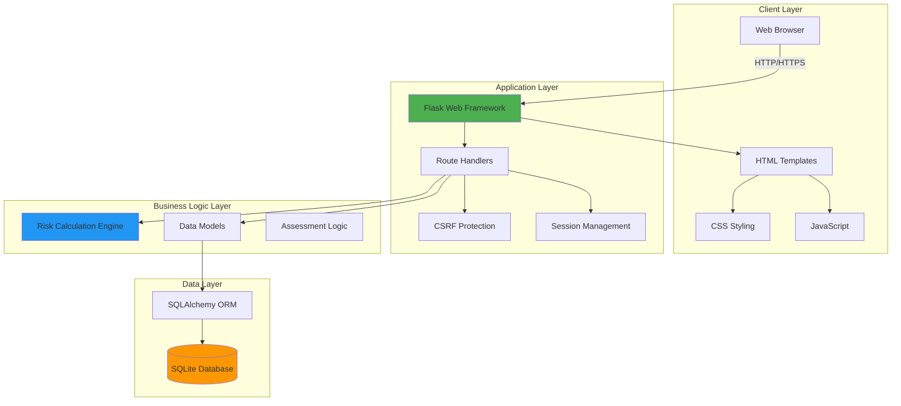
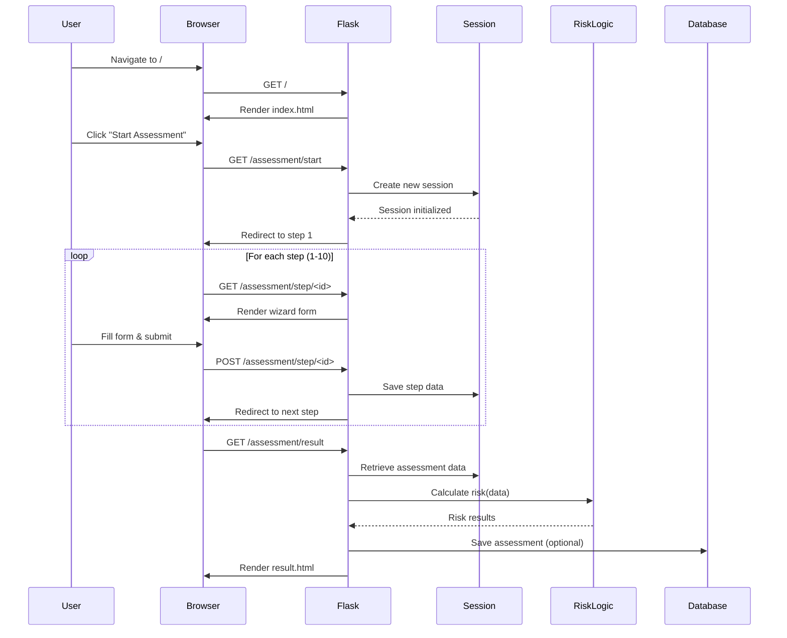

# Architecture Overview - Ain't all Risky Bizz

## Table of Contents
- [System Overview](#system-overview)
- [Architecture Diagram](#architecture-diagram)
- [Technology Stack](#technology-stack)
- [Component Details](#component-details)
- [Data Flow](#data-flow)
- [Security Features](#security-features)
- [Deployment](#deployment)

## System Overview

**Ain't all Risky Bizz** is a web-based risk assessment application built on the NIST 800-30 framework. It provides an interactive wizard-driven interface for conducting cybersecurity risk assessments, guiding users through threat identification, vulnerability analysis, and risk calculation.

### Purpose
- Enable structured cybersecurity risk assessments
- Provide step-by-step guidance through the NIST 800-30 methodology
- Calculate semi-quantitative risk scores based on industry standards
- Store assessment data for future reference and analysis

## Architecture Diagram



## Technology Stack

### Backend
| Component | Technology | Version | Purpose |
|-----------|-----------|---------|---------|
| **Runtime** | Python | 3.11 | Application runtime |
| **Web Framework** | Flask | 3.1.2 | HTTP server and routing |
| **WSGI Server** | Gunicorn | 21.2.0 | Production application server |
| **ORM** | SQLAlchemy | 2.0.44 | Database abstraction |
| **Database** | SQLite | 3.x | Data persistence |
| **Security** | Flask-WTF | 1.2.1 | CSRF protection |
| **Extensions** | Flask-SQLAlchemy | 3.1.1 | Flask-SQLAlchemy integration |
| **Migrations** | Flask-Migrate | 4.0.7 | Database schema management |

### Frontend
| Component | Technology | Purpose |
|-----------|-----------|---------|
| **Markup** | HTML5 | Page structure |
| **Styling** | CSS3 | Visual design |
| **Interactivity** | Vanilla JavaScript | Client-side behavior |
| **Icons/Assets** | PNG Images | Branding |

### DevOps
| Component | Technology | Purpose |
|-----------|-----------|---------|
| **Containerization** | Docker | Application packaging |
| **Base Image** | Python 3.11 Alpine | Minimal container footprint |
| **WSGI Server** | Gunicorn | Production application server |
| **CI/CD** | GitHub Actions | Automated testing and building |
| **Migrations** | Flask-Migrate | Database schema management |

## Component Details

### 1. Application Core (`app.py`)
- **Flask Application**: Main application instance and configuration
- **Route Handlers**: HTTP endpoint definitions
- **Security Configuration**: 
  - CSRF protection via Flask-WTF
  - Secure session cookies (production-enforced)
  - Strict environment-based secret key validation
  - Security headers (HSTS, X-Frame-Options, X-Content-Type-Options)
- **Database Initialization**: Automatic table creation and migrations
- **Logging**: Structured logging configuration for production observability
- **Migration Support**: Flask-Migrate integration for schema management

### 2. Data Models (`models.py`)
- **Assessment Model**: Stores assessment metadata and timestamps
- **RiskEntry Model**: Stores individual risk assessment entries
- **Relationships**: Defines associations between assessments and entries
- **Schema Management**: Handled by SQLAlchemy ORM

### 3. Risk Calculation Engine (`risk_logic.py`)
- **NIST 800-30 Implementation**: Semi-quantitative risk matrices
- **Likelihood Calculation**: Combines initiation and impact likelihood
- **Risk Level Determination**: Matrix-based risk scoring (Very Low → Very High)
- **Qualitative Descriptors**: Maps numeric scores to risk categories

### 4. Templates (`templates/`)
- **base.html**: Master template with navigation and layout
- **index.html**: Landing page
- **about.html**: Information about the application
- **assessment_wizard.html**: 10-step assessment wizard interface
- **result.html**: Risk assessment results display

### 5. Static Assets (`static/`)
- **style.css**: Application styling and responsive design (9.8 KB)
- **script.js**: Client-side interactivity (516 B)
- **favicon.png**: Application branding (377 KB)

### 6. Testing (`tests/`)
- **test_risk_logic.py**: Unit tests for risk calculation algorithms
- **test_app_security.py**: Security header and configuration tests
- **test_integration.py**: End-to-end integration tests for assessment flow
- **Test Framework**: Python unittest

### 7. Report Generation Scripts
- **generate_architecture_presentation.py**: Creates architecture diagrams
- **generate_security_report.py**: Generates security assessment reports
- **generate_remediation_report.py**: Creates remediation documentation

## Data Flow

### Assessment Workflow



### Risk Calculation Process

1. **Input Collection**: Gather threat, vulnerability, and impact data (10 steps)
2. **Likelihood Calculation**: Combine initiation and impact likelihoods
3. **Risk Matrix Lookup**: Map likelihood × impact to risk level
4. **Result Presentation**: Display risk score with recommendations

## Security Features

### Implemented Protections

| Feature | Implementation | Purpose |
|---------|---------------|---------|
| **CSRF Protection** | Flask-WTF CSRFProtect | Prevents cross-site request forgery |
| **Secure Sessions** | Flask session cookies | HTTPOnly and Secure cookies (production) |
| **Secret Key Management** | Environment variables (strict) | Enforced in production, fails if missing |
| **Security Headers** | Custom middleware | HSTS, X-Frame-Options, X-Content-Type-Options |
| **Non-root User** | Docker USER directive | Reduces container attack surface |
| **Input Validation** | Flask form handling | Prevents injection attacks |
| **Debug Mode** | Environment-based | Disabled in production configuration |

### Production Recommendations

> [!NOTE]
> Production security features have been implemented:

1. ✅ **HTTPS Ready**: `SESSION_COOKIE_SECURE` enabled when `FLASK_ENV=production`
2. ✅ **Strong Secret Key**: Strictly enforced from environment in production
3. ✅ **Production WSGI Server**: Gunicorn configured with multi-worker setup
4. ⚠️ **Database Backups**: Implement regular SQLite backup strategy (recommended)
5. ⚠️ **Rate Limiting**: Add request throttling to prevent abuse (recommended)
6. ✅ **Security Headers**: HSTS, X-Frame-Options, X-Content-Type-Options implemented

## Deployment

### Docker Deployment (Recommended)

The application includes an optimized multi-stage Dockerfile:

**Build the Image:**
```bash
docker build -t aint-all-risky-bizz:latest .
```

**Run the Container:**
```bash
docker run -d -p 5000:5000 \
  -e SECRET_KEY="your-secret-key-here" \
  -e FLASK_ENV="production" \
  --name risky-app \
  aint-all-risky-bizz:latest
```

> [!IMPORTANT]
> The container automatically runs database migrations on startup via `flask db upgrade`.

**Container Features:**
- **Base Image**: Python 3.11 Alpine Linux (lightweight)
- **Multi-stage Build**: Separates build dependencies from runtime
- **Image Size**: ~169 MB (optimized)
- **Health Checks**: Built-in container health monitoring
- **Non-root User**: Runs as unprivileged `appuser` (UID 1000)

### Local Development

**Install Dependencies:**
```bash
pip install -r requirements.txt
```

**Run Application:**
```bash
python app.py
```

**Access Application:**
Navigate to `http://localhost:5000`

### Environment Variables

| Variable | Default | Production | Description |
|----------|---------|------------|-------------|
| `FLASK_APP` | `app.py` | `app.py` | Flask application entry point |
| `FLASK_ENV` | - | `production` | Environment mode (enables strict security) |
| `SECRET_KEY` | `dev-secret-key...` | **Required** | Flask secret key (fails if missing in prod) |
| `SESSION_COOKIE_SECURE` | `False` | `True` | Automatic when FLASK_ENV=production |
| `PYTHONUNBUFFERED` | `1` | `1` | Disable Python output buffering |

## Project Structure

```
d:/agy-projects/
├── app.py                          # Main Flask application
├── models.py                       # Database models (SQLAlchemy)
├── risk_logic.py                   # NIST 800-30 risk calculation engine
├── gunicorn_config.py              # Gunicorn production configuration
├── requirements.txt                # Python dependencies
├── Dockerfile                      # Multi-stage Docker build
├── README.md                       # Project documentation
├── ARCHITECTURE.md                 # This file
├── prod_ready_plan.md              # Production readiness plan
├── risk_assessment_methodology_review.md  # Methodology review
├── walkthrough.md                  # Production verification evidence
│
├── .github/                        # GitHub workflows
│   └── workflows/
│       └── ci.yml                  # CI/CD pipeline
│
├── templates/                      # Jinja2 HTML templates
│   ├── base.html                   # Base layout template
│   ├── index.html                  # Landing page
│   ├── about.html                  # About page
│   ├── assessment_wizard.html      # 10-step wizard
│   └── result.html                 # Results display
│
├── static/                         # Static assets
│   ├── style.css                   # Application styles
│   ├── script.js                   # Client-side JavaScript
│   └── favicon.png                 # Application icon
│
├── migrations/                     # Database migrations
│   ├── alembic.ini                 # Alembic configuration
│   ├── env.py                      # Migration environment
│   └── versions/                   # Migration scripts
│
├── instance/                       # Instance-specific files
│   └── risk_assessment.db          # SQLite database
│
├── tests/                          # Test suite
│   ├── test_risk_logic.py          # Risk logic unit tests
│   ├── test_app_security.py        # Security tests
│   └── test_integration.py         # Integration tests
│
├── docs/                           # Documentation
│   └── evidence/                   # Verification evidence
│       ├── home_page.png
│       └── wizard_step_1.png
│
└── reports/                        # Generated reports
    ├── Architecture_Overview.pdf
    ├── Architecture_Overview.pptx
    ├── Security_Review_Report.pdf
    ├── Security_Review_Report.pptx
    ├── Remediation_Report.pdf
    └── Remediation_Report.pptx
```

## Database Schema

### Assessment Table
| Column | Type | Description |
|--------|------|-------------|
| `id` | INTEGER | Primary key |
| `created_at` | DATETIME | Timestamp of creation |
| `updated_at` | DATETIME | Timestamp of last update |

### RiskEntry Table
| Column | Type | Description |
|--------|------|-------------|
| `id` | INTEGER | Primary key |
| `assessment_id` | INTEGER | Foreign key to Assessment |
| `threat_source` | TEXT | Identified threat source |
| `threat_event` | TEXT | Threat event description |
| `vulnerability` | TEXT | Vulnerability description |
| `likelihood` | INTEGER | Calculated likelihood (1-5) |
| `impact` | INTEGER | Impact level (1-5) |
| `risk_level` | TEXT | Calculated risk level |

## Performance Considerations

- **Session Storage**: Uses server-side sessions (can be migrated to Redis for scaling)
- **Database**: SQLite suitable for low-to-medium traffic; consider PostgreSQL for high concurrency
- **Static Assets**: Minimal bundle size (~387 KB total)
- **Container**: Optimized Alpine-based image for fast startup and low memory footprint

## Production Readiness Status

### ✅ Completed
- [x] Gunicorn WSGI server for production
- [x] Database migrations (Flask-Migrate)
- [x] Structured logging configuration
- [x] Security headers (HSTS, X-Frame-Options, etc.)
- [x] Strict environment variable validation
- [x] CI/CD pipeline (GitHub Actions)
- [x] Integration and security tests
- [x] Docker multi-stage build optimization

### 🔄 Recommended
- [ ] PostgreSQL migration for production scale
- [ ] Redis for session storage
- [ ] Rate limiting middleware
- [ ] Automated database backups

## Future Enhancements

- [ ] Export assessments to PDF/CSV
- [ ] Multi-user support with authentication (RBAC)
- [ ] Assessment templates and presets
- [ ] Historical trend analysis dashboard
- [ ] API endpoints for integration
- [ ] Real-time threat intelligence feeds

---

**Version**: 2.0 (Production Ready)  
**Last Updated**: 2025-11-28  
**Maintained By**: silver3parre  
**Branch**: `production`
