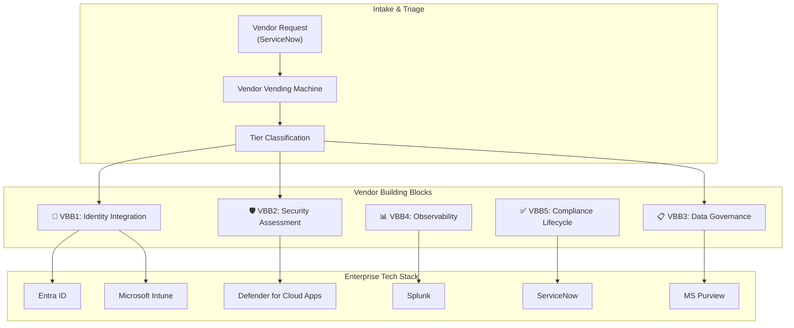
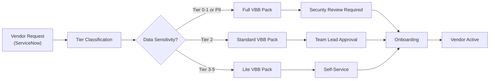

# Vendor Paved Road — Bought Systems Governance Framework

**Date:** 2026-01-29  
**Author:** Principal Architect  
**Version:** 1.0  
**Status:** **APPROVED**  
**Aligned With:** [EA Principles v3.1](../ea_principles_v3.md), [Application Tiering Matrix](../application_tiering_matrix.md), [Paved Road Proposal (Built)](../paved_road_proposal.md)

---

## Executive Summary

The **Paved Road Platform** provides comprehensive governance for **built** systems (custom-developed applications). This companion framework — the **Vendor Paved Road** — extends the same governance principles to **bought** systems: COTS (Commercial Off-The-Shelf), SaaS, and locally-installed software.

The same controls apply. The same tier matrix applies. But the **control points are different**:

| Built Systems                      | Bought Systems                           |
| ---------------------------------- | ---------------------------------------- |
| Source code                        | Vendor contracts                         |
| CI/CD pipelines                    | Configuration validation                 |
| SAST/DAST scanning                 | Security questionnaires & certifications |
| IaC (Terraform)                    | API integrations & SSO                   |
| SVM (Subscription Vending Machine) | VVM (Vendor Vending Machine)             |

> *"Whether you build it or buy it, the security, compliance, and operational standards are the same — only the levers change."*

---

## Core Philosophy: Same Guardrails, Different Levers

| Netflix/Paved Road Concept | Built Implementation                  | Bought Implementation                         |
| -------------------------- | ------------------------------------- | --------------------------------------------- |
| **Paved Road**             | Pre-configured Building Blocks        | Pre-validated vendor integration templates    |
| **Opinionated Defaults**   | IaC templates with security baked in  | SSO/DPA templates with clauses baked in       |
| **Self-Service**           | SVM dispenses Landing Zones           | VVM dispenses onboarding packs                |
| **Off-Road Allowed**       | "Comply or Explain" for custom builds | "Comply or Explain" for non-compliant vendors |
| **Automated Guardrails**   | CI/CD gates that block                | CASB policies that alert/block                |

---

## Scope: System Types Covered

| System Type              | Examples                                  | Primary Control Points                  |
| ------------------------ | ----------------------------------------- | --------------------------------------- |
| **SaaS**                 | Salesforce, ServiceNow, Slack, Zoom, M365 | Contracts, SSO, API configs, DPA        |
| **IaaS/PaaS (Managed)**  | Databricks, Snowflake, MongoDB Atlas      | Same as SaaS + VNet integration         |
| **Installed Software**   | Autodesk, MATLAB, SAP GUI, Visual Studio  | License mgmt, Intune policies, patching |
| **Embedded/OT Software** | BMS, IoT platforms, SCADA                 | Network segmentation, vendor patching   |

---

## Vendor Building Block Architecture

The Vendor Paved Road is organized into **5 Vendor Building Blocks (VBBs)** that parallel the core Building Blocks for built systems:

---

## Vendor Building Block Definitions

### VBB1: Vendor Identity Integration
**Parallel to:** BB1 (Identity & Access Foundation)

**What It Provides:**
- SSO integration via OIDC/SAML with Entra ID
- SCIM-based user provisioning and deprovisioning
- Conditional Access policies targeting vendor applications
- Session management and timeout configuration

**Self-Service Experience:**
> *As a Product Owner, when I onboard a new SaaS vendor, I receive a pre-configured Entra ID Enterprise Application template with appropriate Conditional Access policies for my tier.*

| Tier | SSO                   | Provisioning      | MFA         | Conditional Access                |
| ---- | --------------------- | ----------------- | ----------- | --------------------------------- |
| 0-1  | Mandatory (OIDC/SAML) | SCIM required     | Mandatory   | Strict (Device + Location + Risk) |
| 2    | Mandatory (OIDC/SAML) | SCIM preferred    | Mandatory   | Standard (MFA enforced)           |
| 3-5  | Preferred (SAML)      | Manual acceptable | Recommended | Basic                             |

**Installed Software Considerations:**
- Intune application deployment package (recommended)
- License server integration where applicable
- Update management via Intune or WSUS

**Detailed Checklist:** [VBB1_Vendor_Identity_Checklist.md](checklists/VBB1_Vendor_Identity_Checklist.md)

---

### VBB2: Vendor Security Assessment
**Parallel to:** BB4 (Security Scanning)

**What It Provides:**
- Pre-contract security due diligence
- Ongoing vendor risk monitoring
- CASB integration for SaaS visibility
- Contractual security requirements

**Self-Service Experience:**
> *As a Procurement Lead, I use the standardized SIG Lite questionnaire and receive a risk score that determines the approval path — self-service for low risk, Security review for high risk.*

| Assessment               | When                   | Tier 0-1           | Tier 2             | Tier 3-5    |
| ------------------------ | ---------------------- | ------------------ | ------------------ | ----------- |
| SIG Lite Questionnaire   | Pre-contract           | Mandatory          | Mandatory          | Recommended |
| SOC 2 Type II            | Pre-contract + Annual  | Mandatory          | Mandatory          | Optional    |
| ISO 27001 Certificate    | Pre-contract + Annual  | Mandatory          | Preferred          | Optional    |
| Penetration Test Results | Pre-contract + Annual  | Mandatory          | Recommended        | N/A         |
| Subprocessor Review      | Pre-contract + Changes | Mandatory          | Mandatory          | Recommended |
| CASB Integration         | Post-deployment        | Mandatory (if PII) | Mandatory (if PII) | Optional    |

**CASB Policy (Defender for Cloud Apps):**
- Block unsanctioned app access (Shadow IT)
- Alert on bulk download from Tier 0-2 SaaS
- Enforce session controls for high-risk sign-ins

**Detailed Checklist:** [VBB2_Vendor_Security_Assessment.md](checklists/VBB2_Vendor_Security_Assessment.md)

---

### VBB3: Vendor Data Governance
**Parallel to:** BB9 (Data Foundations)

**What It Provides:**
- Data Processing Agreement (DPA) validation
- Data residency assurance
- Data portability and export requirements
- PII handling and deletion SLAs

**Self-Service Experience:**
> *As a Legal/Procurement team member, I use the DPA checklist to ensure the vendor contract includes all required GDPR Article 28 clauses before signing.*

| Requirement                | Tier 0-1           | Tier 2             | Tier 3-5        |
| -------------------------- | ------------------ | ------------------ | --------------- |
| DPA (GDPR Art. 28)         | Mandatory          | Mandatory          | Recommended     |
| Data Residency (EU)        | Mandatory          | Mandatory          | Preferred       |
| Data Export (Open Formats) | Mandatory          | Mandatory          | Preferred       |
| Data Deletion SLA          | ≤30 days           | ≤90 days           | Best effort     |
| PII Inventory              | Required           | Required           | Recommended     |
| Encryption at Rest         | AES-256 mandatory  | AES-256 mandatory  | Vendor standard |
| Encryption in Transit      | TLS 1.2+ mandatory | TLS 1.2+ mandatory | TLS 1.2+        |
| Right to Audit             | Mandatory          | Preferred          | N/A             |

**Alignment with Data Principles:**
- **Data as a Strategic Asset:** Export in open formats (CSV, JSON, Parquet)
- **Data Integrity & Governance:** Lineage documentation where applicable
- **Private by Design:** PII handling clauses, anonymization capabilities

**Detailed Checklist:** [VBB3_Vendor_Data_Governance.md](checklists/VBB3_Vendor_Data_Governance.md)

---

### VBB4: Vendor Observability Integration
**Parallel to:** BB6 (Observability Stack)

**What It Provides:**
- Security and audit log streaming to Splunk
- Uptime and availability monitoring
- Alerting integration with ServiceNow
- Incident notification requirements

**Self-Service Experience:**
> *As a Security Analyst, vendor audit logs automatically flow to Splunk, and I can correlate vendor activity with internal systems in a single pane of glass.*

| Log Type            | Destination   | Mechanism                  | Tier Requirement      |
| ------------------- | ------------- | -------------------------- | --------------------- |
| Security/Audit Logs | Splunk        | API → Splunk HEC           | Tier 0-2 Mandatory    |
| Authentication Logs | Splunk        | Via Entra ID sign-in logs  | All tiers (automatic) |
| Availability        | Azure Monitor | Synthetic probes / Webhook | Tier 0-2              |
| Incident Alerts     | ServiceNow    | Webhook / Email            | Tier 0-1 Mandatory    |

**SLA Requirements by Tier:**

| Tier | Uptime SLA  | Notification SLA | Log Retention |
| ---- | ----------- | ---------------- | ------------- |
| 0-1  | ≥99.9%      | ≤15 min          | ≥2 years      |
| 2    | ≥99.5%      | ≤1 hour          | ≥1 year       |
| 3-5  | Best effort | ≤24 hours        | ≥90 days      |

**Detailed Checklist:** [VBB4_Vendor_Observability_Checklist.md](checklists/VBB4_Vendor_Observability_Checklist.md)

---

### VBB5: Vendor Compliance Lifecycle
**Parallel to:** BB8 (Compliance Dashboard)

**What It Provides:**
- Vendor registration in ServiceNow CMDB
- Annual re-assessment scheduling
- Certificate expiry tracking
- Exit/transition planning

**Self-Service Experience:**
> *As a Vendor Manager, I receive automatic reminders 90 days before contract renewal with a pre-populated re-assessment checklist.*

| Activity                | Frequency | Owner                  | Trigger               |
| ----------------------- | --------- | ---------------------- | --------------------- |
| Initial Risk Assessment | One-time  | Procurement + Security | New vendor request    |
| Annual Re-Assessment    | Annual    | Vendor Manager         | Calendar (ServiceNow) |
| Certificate Check       | Annual    | Security               | 30-day expiry alert   |
| Subprocessor Review     | Ad-hoc    | Security               | Vendor notification   |
| Contract Renewal        | Per term  | Procurement            | 90-day expiry alert   |
| Incident Review         | Ad-hoc    | Security + Vendor Mgr  | Breach notification   |

**Exit Planning (Tier 0-1 Mandatory):**
- Data export procedure documented
- User migration timeline
- Replacement vendor identified (or build plan)
- Maximum 90-day transition window

**Detailed Checklist:** [VBB5_Vendor_Compliance_Lifecycle.md](checklists/VBB5_Vendor_Compliance_Lifecycle.md)

---

## Vendor Vending Machine (VVM)

Just as the **Subscription Vending Machine (SVM)** dispenses ready-to-use Azure Landing Zones for built systems, the **Vendor Vending Machine (VVM)** dispenses ready-to-use onboarding packs for bought systems.

### VVM Workflow

### VVM Outputs by Tier

| Tier             | Pack Contents                                                                                                                                     |
| ---------------- | ------------------------------------------------------------------------------------------------------------------------------------------------- |
| **0-1 (Full)**   | Entra SSO template, SCIM guide, Strict DPA template, SIG Lite questionnaire, Splunk integration guide, Exit plan template, Annual review schedule |
| **2 (Standard)** | Entra SSO template, Standard DPA template, SIG Lite questionnaire (subset), Splunk integration guide                                              |
| **3-5 (Lite)**   | Entra SSO guide (optional), Minimal security questionnaire, Self-service acceptance form                                                          |

---

## Small Vendor Speed Lane (Exception Process)

> **Purpose:** Enable rapid adoption of niche, low-cost tools (e.g., specialized engineering software) where hefty governance burdens would block business value.

### Eligibility Criteria (Must meet ALL)
1.  **Tier:** 3, 4, or 5 (Non-Critical)
2.  **Spend:** < 50,000 DKK (~€6,700) per year
3.  **Data:** **NO PII** and **NO Restricted Data**
4.  **Users:** Limited scope (Team/Project level)

### Speed Lane Requirements
| Control Area            | Standard Path Requirement | Speed Lane Requirement                                   |
| ----------------------- | ------------------------- | -------------------------------------------------------- |
| **Security Assessment** | SIG Lite + SOC 2          | **Reputation Check** (VirusTotal, Trustpilot, Community) |
| **Identity**            | SSO Required              | **Unique Password + MFA** (Password Manager)             |
| **Endpoint**            | User Managed              | **Intune + Defender** (Mandatory Sandbox)                |
| **Contract**            | DPA Mandatory             | **Standard EULA** (Accepted if Data < Restricted)        |

---

## Tier-Based Requirements Matrix

| Control Area               | Tier 0-1            | Tier 2       | Tier 3-5    |
| -------------------------- | ------------------- | ------------ | ----------- |
| **SSO (OIDC/SAML)**        | Mandatory           | Mandatory    | Preferred   |
| **SCIM Provisioning**      | Mandatory           | Preferred    | Optional    |
| **Conditional Access**     | Strict              | Standard     | Basic       |
| **SOC 2 / ISO 27001**      | Both + Annual       | One + Annual | Optional    |
| **Penetration Test**       | Required            | Recommended  | N/A         |
| **SIG Lite Questionnaire** | Full                | Subset       | Minimal     |
| **CASB (if PII)**          | Mandatory           | Mandatory    | Optional    |
| **DPA**                    | Strict              | Standard     | Recommended |
| **Data Residency (EU)**    | Mandatory           | Mandatory    | Preferred   |
| **Splunk Integration**     | Mandatory           | Mandatory    | Optional    |
| **Annual Review**          | Security + Business | Security     | Ad-hoc      |
| **Exit Plan**              | Mandatory           | Recommended  | N/A         |
| **Intune (if installed)**  | Mandatory           | Recommended  | Optional    |

---

## Mapping: Built vs. Bought Building Blocks

| Built (BB)             | Bought (VBB)                      | Control Parity                       |
| ---------------------- | --------------------------------- | ------------------------------------ |
| BB1: Identity & Access | VBB1: Vendor Identity Integration | SSO, MFA, Conditional Access         |
| BB4: Security Scanning | VBB2: Vendor Security Assessment  | Questionnaires, Certifications, CASB |
| BB9: Data Foundations  | VBB3: Vendor Data Governance      | DPA, Residency, Export, PII          |
| BB6: Observability     | VBB4: Vendor Observability        | Logging, Uptime, Alerting            |
| BB8: Compliance        | VBB5: Vendor Compliance Lifecycle | Reviews, Tracking, Exit              |
| SVM                    | VVM                               | Self-service onboarding              |

---

## Principle Alignment

| EA Principle                            | How Vendor Paved Road Aligns                                            |
| --------------------------------------- | ----------------------------------------------------------------------- |
| **Scalable by Design**                  | Standardized onboarding process scales across all vendor types          |
| **Build What Matters**                  | Focus governance effort on high-tier vendors; self-service for low-tier |
| **Responsible by Design**               | Security, compliance, and privacy embedded in vendor selection          |
| **Technology as Competitive Advantage** | Fast, governed vendor onboarding enables business agility               |

---

## Templates & Resources

| Resource                   | Purpose                | Location                                                                            |
| -------------------------- | ---------------------- | ----------------------------------------------------------------------------------- |
| SIG Lite Questionnaire     | Security due diligence | [External: Shared Assessments](https://sharedassessments.org/)                      |
| DPA Checklist              | Contract review        | [vendor_dpa_checklist.md](templates/vendor_dpa_checklist.md)                        |
| Vendor Risk Assessment     | Initial triage         | [vendor_risk_assessment_template.md](templates/vendor_risk_assessment_template.md)  |
| Entra Enterprise App Guide | SSO configuration      | [Microsoft Docs](https://learn.microsoft.com/en-us/entra/identity/enterprise-apps/) |

---

## User Review Required

> [!NOTE]
> **Decisions Made (Optimal Defaults):**
> 1. **Security Questionnaire:** SIG Lite (industry standard, comprehensive)
> 2. **CASB:** Mandatory for Tier 0-2 SaaS handling PII
> 3. **Installed Software:** Intune recommended; ServiceNow license mgmt optional
> 4. **Exit Planning:** Mandatory for Tier 0-1

---

## Next Steps

1. **Pilot:** Select 1-2 upcoming vendor procurements as pilot
2. **Training:** Brief Procurement and Security teams on VBB checklists
3. **ServiceNow:** Create VVM request catalog item (Phase 2)
4. **Integration:** Align with existing vendor management process

---

## Related Documents

- [Paved Road Proposal (Built Systems)](../paved_road_proposal.md)
- [EA Principles v3.1](../ea_principles_v3.md)
- [Application Tiering Matrix](../application_tiering_matrix.md)
- [Data Principles v3.1](../data_principles_v3.md)
- [Green Patterns Checklist](../green_patterns_checklist.md)
