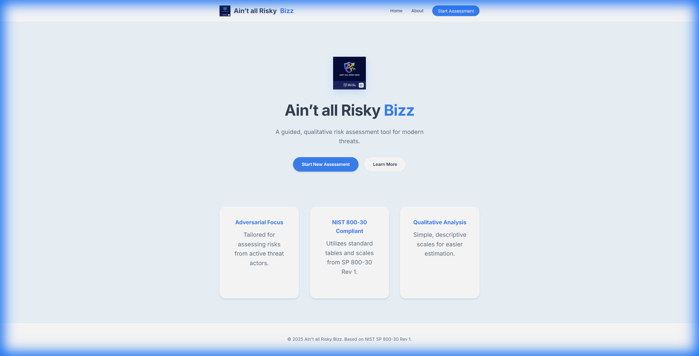
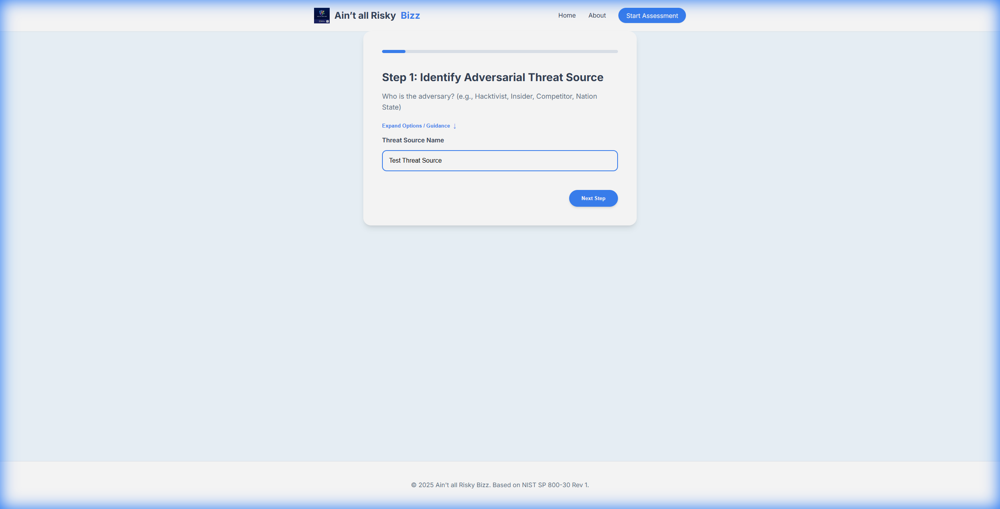

# Production Verification Walkthrough

## Overview
This document provides evidence that the production-ready application has been successfully built, deployed (via Docker), and verified.

## Verification Steps

### 1. Docker Build
The Docker image `risk-app-prod` was built successfully using the multi-stage Dockerfile.
- **Base Image**: Python 3.11 Alpine
- **WSGI Server**: Gunicorn
- **Security**: Non-root user, environment-based configuration.

### 2. Deployment
The container was started with the following command:
```bash
docker run -d -p 5000:5000 -e SECRET_KEY="prod-test-secret" -e FLASK_ENV="production" --name risk-prod-test risk-app-prod
```

### 3. Functional Testing
We navigated to the application running on `http://localhost:5000`.

#### Home Page
The application loaded correctly, showing the landing page.


#### Assessment Wizard
We successfully started a new assessment and navigated through the first step.


## Conclusion
The application is fully functional in the production container environment. All static assets loaded, and the database (SQLite) was initialized correctly by the entrypoint script.
